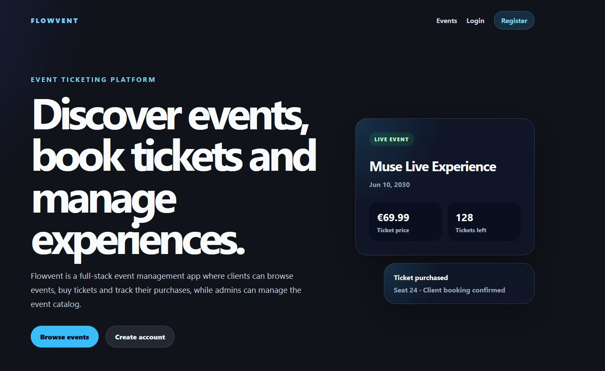
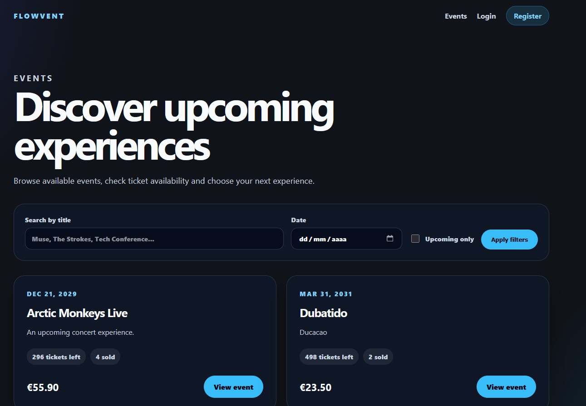
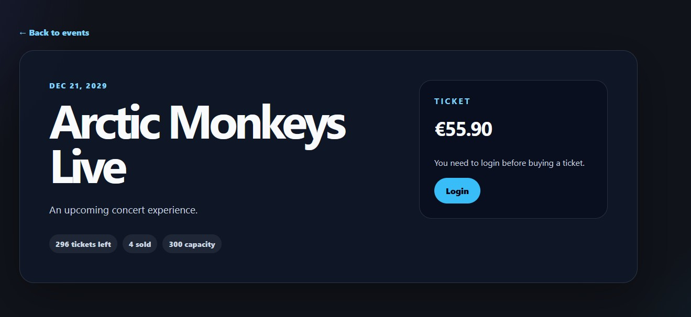
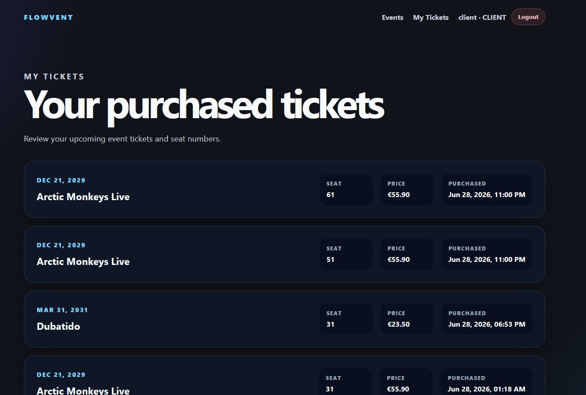
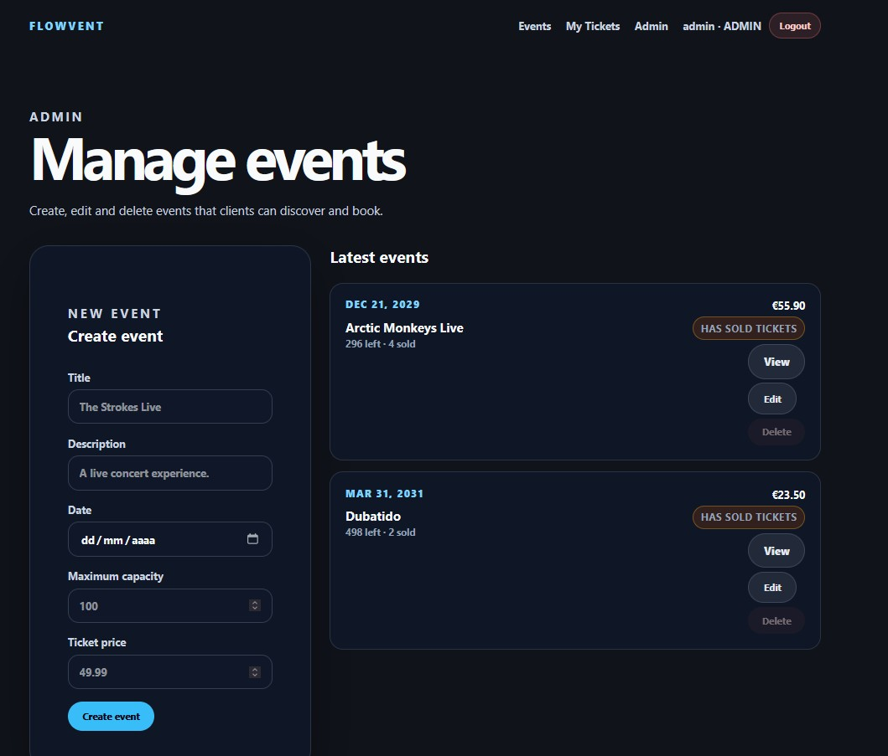
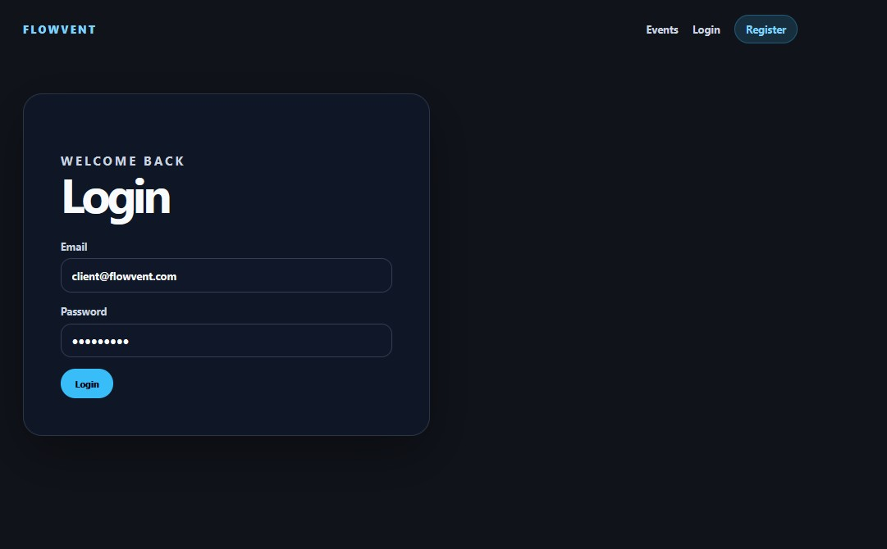

# Flowvent

Flowvent is a full-stack event management and ticketing platform built with **Spring Boot**, **PostgreSQL**, **JWT authentication**, **React**, **TypeScript** and **Vite**.

The application allows users to register, log in, browse events, search and filter events, buy tickets, view their purchased tickets, and access role-based features. Admin users can create, edit and delete events through a protected admin dashboard.

---

## Screenshots

### Home



### Event Catalog



### Event Detail



### My Tickets



### Admin Event Management



### Login



---

## Tech Stack

### Backend

* Java
* Spring Boot
* Spring Data JPA / Hibernate
* Spring Security
* JWT Authentication
* PostgreSQL
* Docker Compose
* Swagger / OpenAPI
* JUnit 5
* Mockito

### Frontend

* React
* TypeScript
* Vite
* React Router
* Fetch API
* CSS

---

## Features

### Authentication & Authorization

* User registration
* User login
* JWT-based authentication
* Persistent frontend authentication with `localStorage`
* Authenticated user endpoint with `/api/auth/me`
* Role-based authorization with `ADMIN` and `CLIENT`
* Protected frontend routes
* Admin-only frontend routes

### Events

* Public event listing
* Event detail page
* Event search by title
* Event filtering by date
* Upcoming events filter
* Pagination
* Event availability metrics:

  * `soldTickets`
  * `availableTickets`

### Tickets

* Ticket purchase flow
* Ticket ownership validation
* Personal ticket listing with `/api/tickets/me`
* Prevention of duplicate seats for the same event
* Prevention of purchases for past events
* Prevention of purchases when an event is full
* User-friendly frontend error messages

### Admin

* Admin dashboard
* Create events
* Edit events
* Delete events
* Prevent deletion of events with sold tickets
* Visual admin warning for events with sold tickets
* Role-protected admin routes

### UX

* Responsive layout
* Loading skeletons
* Empty states
* Form validation
* User-friendly error messages
* Landing page suitable for portfolio presentation

---

## Roles

### ADMIN

An admin can:

* Create events
* Update events
* Delete events without sold tickets
* View all events
* View tickets by event
* Access the admin dashboard
* Manage the event catalog

### CLIENT

A client can:

* Register an account
* Log in
* Browse public events
* Search and filter events
* View event details
* Buy tickets
* View their purchased tickets
* Update or delete only their own tickets through the API

---

## Demo Credentials

The development database is seeded with demo users.

### Admin

```text
Email: admin@flowvent.com
Password: admin123
```

### Client

```text
Email: client@flowvent.com
Password: client123
```

---

## Requirements

* Java 21 or newer
* Node.js 20.19+ or 22.12+
* Docker Desktop
* Maven Wrapper included in the project

---

## Project Structure

```text
Flowvent/
├── frontend/
│   ├── src/
│   │   ├── api/
│   │   ├── components/
│   │   ├── context/
│   │   ├── pages/
│   │   ├── types/
│   │   ├── App.tsx
│   │   ├── App.css
│   │   └── main.tsx
│   ├── package.json
│   └── vite.config.ts
│
├── src/
│   ├── main/
│   │   ├── java/com/event/Flowvent/
│   │   └── resources/
│   └── test/
│
├── docs/
│   └── screenshots/
│
├── docker-compose.yml
├── pom.xml
├── mvnw
└── README.md
```

---

## Environment Variables

The backend uses environment variables for database and JWT configuration.

Create a `.env` file based on `.env.example` for reference.

> Important: Spring Boot does not automatically load `.env` files by default. When running locally from PowerShell, set the environment variables in the terminal before starting the backend.

### Example `.env.example`

```env
DB_URL=jdbc:postgresql://localhost:5432/flowvent
DB_USER=postgres
DB_PASSWORD=your_database_password

JWT_SECRET=your_jwt_secret_key_here
JWT_EXPIRATION=86400000
```

Make sure the real `.env` file is not committed to Git.

### `.gitignore`

```gitignore
.env
node_modules
frontend/node_modules
frontend/dist
```

### Example `application.properties`

```properties
server.port=8081

spring.datasource.url=${DB_URL:jdbc:postgresql://localhost:5432/flowvent}
spring.datasource.username=${DB_USER:postgres}
spring.datasource.password=${DB_PASSWORD}

spring.jpa.hibernate.ddl-auto=update
spring.jpa.show-sql=true

jwt.secret=${JWT_SECRET}
jwt.expiration=${JWT_EXPIRATION:86400000}
```

---

## Database Setup

Start PostgreSQL using Docker Compose from the project root:

```bash
docker compose up -d
```

PostgreSQL will be available at:

```text
localhost:5432
```

Default database:

```text
flowvent
```

Useful Docker commands:

```bash
docker ps
docker logs flowvent-postgres
docker compose down
docker compose down -v
```

---

## Run the Backend

From the project root:

```powershell
cd C:\Users\beryp\Desktop\LonelyCodingVibes\Flowvent
```

Set environment variables:

```powershell
$env:JAVA_HOME="C:\Users\beryp\.jdks\openjdk-23.0.1"
$env:Path="$env:JAVA_HOME\bin;$env:Path"

$env:DB_URL="jdbc:postgresql://localhost:5432/flowvent"
$env:DB_USER="postgres"
$env:DB_PASSWORD="your_database_password"
$env:JWT_SECRET="your_jwt_secret_key_here"
$env:JWT_EXPIRATION="86400000"
```

Start the backend:

```powershell
.\mvnw spring-boot:run
```

The backend will run at:

```text
http://localhost:8081
```

---

## Run the Frontend

From the frontend folder:

```powershell
cd C:\Users\beryp\Desktop\LonelyCodingVibes\Flowvent\frontend
npm install
npm run dev
```

The frontend will run at:

```text
http://localhost:5173
```

---

## Swagger / OpenAPI

Swagger UI:

```text
http://localhost:8081/swagger-ui/index.html
```

OpenAPI JSON:

```text
http://localhost:8081/v3/api-docs
```

---

## Authentication Flow

### Register

```http
POST /api/auth/register
```

#### Request

```json
{
  "username": "client",
  "email": "client@flowvent.com",
  "password": "client123"
}
```

#### Response

```json
{
  "token": "jwt-token"
}
```

New users are registered as `CLIENT` by default.

---

### Login

```http
POST /api/auth/login
```

#### Request

```json
{
  "email": "client@flowvent.com",
  "password": "client123"
}
```

#### Response

```json
{
  "token": "jwt-token"
}
```

Use the JWT token in Swagger by clicking **Authorize** and pasting the token.

---

### Authenticated User

```http
GET /api/auth/me
```

#### Response

```json
{
  "id": 1,
  "username": "client",
  "email": "client@flowvent.com",
  "role": "CLIENT"
}
```

---

## Main API Endpoints

### Auth

| Method | Endpoint             | Description                    | Auth          |
| ------ | -------------------- | ------------------------------ | ------------- |
| POST   | `/api/auth/register` | Register a new user            | Public        |
| POST   | `/api/auth/login`    | Login and receive JWT token    | Public        |
| GET    | `/api/auth/me`       | Get authenticated user profile | Authenticated |

---

### Events

| Method | Endpoint               | Description                 | Auth   |
| ------ | ---------------------- | --------------------------- | ------ |
| GET    | `/api/events`          | List events with pagination | Public |
| GET    | `/api/events/{id}`     | Get event by ID             | Public |
| GET    | `/api/events/upcoming` | List upcoming events        | Public |
| GET    | `/api/events/search`   | Search events with filters  | Public |
| POST   | `/api/events`          | Create event                | ADMIN  |
| PUT    | `/api/events/{id}`     | Update event                | ADMIN  |
| DELETE | `/api/events/{id}`     | Delete event                | ADMIN  |

---

### Tickets

| Method | Endpoint                       | Description                       | Auth           |
| ------ | ------------------------------ | --------------------------------- | -------------- |
| GET    | `/api/tickets`                 | List all tickets                  | ADMIN          |
| GET    | `/api/tickets/me`              | List authenticated user's tickets | CLIENT / ADMIN |
| GET    | `/api/tickets/event/{eventId}` | List tickets by event             | ADMIN          |
| POST   | `/api/tickets`                 | Buy ticket                        | CLIENT / ADMIN |
| PUT    | `/api/tickets/{id}`            | Update ticket seat                | Owner / ADMIN  |
| DELETE | `/api/tickets/{id}`            | Delete ticket                     | Owner / ADMIN  |

---

### Clients

| Method | Endpoint            | Description   | Auth  |
| ------ | ------------------- | ------------- | ----- |
| GET    | `/api/clients`      | List clients  | ADMIN |
| POST   | `/api/clients`      | Create client | ADMIN |
| PUT    | `/api/clients/{id}` | Update client | ADMIN |
| DELETE | `/api/clients/{id}` | Delete client | ADMIN |

---

## Event Search

Example:

```http
GET /api/events/search?title=arctic&date=2029-12-21&page=0&size=10&sort=date,asc
```

### Supported Filters

| Parameter | Description           |
| --------- | --------------------- |
| `title`   | Search by event title |
| `date`    | Filter by event date  |
| `page`    | Page number           |
| `size`    | Page size             |
| `sort`    | Sorting configuration |

### Example Response

```json
{
  "content": [
    {
      "id": 1,
      "title": "Arctic Monkeys Live",
      "description": "An upcoming concert experience.",
      "date": "2029-12-21",
      "maximumCapacity": 300,
      "ticketPrice": 55.9,
      "soldTickets": 4,
      "availableTickets": 296
    }
  ],
  "totalElements": 1,
  "totalPages": 1,
  "size": 10,
  "number": 0
}
```

---

## Ticket Purchase

```http
POST /api/tickets
```

### Request

```json
{
  "eventId": 1,
  "seatNumber": 12
}
```

### Response

```json
{
  "id": 1,
  "clientName": "client",
  "clientEmail": "client@flowvent.com",
  "eventId": 1,
  "eventTitle": "Arctic Monkeys Live",
  "eventDate": "2029-12-21",
  "seat": 12,
  "ticketPrice": 55.9,
  "purchaseDate": "2026-06-28T23:00:00"
}
```

---

## Pagination

The API supports Spring pagination.

Examples:

```http
GET /api/events?page=0&size=10
GET /api/events/search?page=0&size=10
GET /api/events/upcoming?page=0&size=10
GET /api/tickets?page=0&size=10
GET /api/tickets/me?page=0&size=10
GET /api/tickets/event/{eventId}?page=0&size=10
```

### Sorting Examples

```http
GET /api/events?page=0&size=5&sort=date,asc
```

```http
GET /api/tickets?page=0&size=5&sort=purchaseDate,desc
```

---

## Validation Errors

Example response:

```json
{
  "timestamp": "2026-06-21T21:23:32.5869783",
  "status": 400,
  "error": "Validation failed",
  "messages": {
    "ticketPrice": "Ticket price cannot be negative",
    "description": "Description is required",
    "maximumCapacity": "Maximum capacity must be at least 1",
    "date": "Event date must be in the future",
    "title": "Title is required"
  }
}
```

---

## Business Rules

* No ticket purchases for past events
* No purchases when an event is full
* No duplicate seats per event
* Users can only modify their own tickets
* Admins can manage events and tickets
* CLIENT users must have a linked client profile
* Events with sold tickets cannot be deleted
* Event availability is calculated from ticket count

---

## Frontend Routes

| Route           | Description                | Access        |
| --------------- | -------------------------- | ------------- |
| `/`             | Landing page               | Public        |
| `/events`       | Event catalog              | Public        |
| `/events/:id`   | Event detail               | Public        |
| `/login`        | Login page                 | Public        |
| `/register`     | Register page              | Public        |
| `/my-tickets`   | Authenticated user tickets | Authenticated |
| `/admin/events` | Admin event management     | ADMIN         |

---

## Run Tests

From the project root:

```bash
.\mvnw test
```

### If Java is not detected in PowerShell

```powershell
$env:JAVA_HOME="C:\Users\beryp\.jdks\openjdk-23.0.1"
$env:Path="$env:JAVA_HOME\bin;$env:Path"
.\mvnw test
```

---

## Build Frontend

From the frontend folder:

```bash
npm run build
```

The production build will be generated in:

```text
frontend/dist
```

---

## Test Coverage

The backend includes unit and controller tests covering:

* Authentication
* Authenticated user endpoint
* Event creation and update
* Event availability calculation
* Event deletion rules
* Ticket purchase flow
* Ticket business rules
* Ticket ownership
* Controller validation
* Global exception handling

---

## Useful Docker Commands

### Start database

```bash
docker compose up -d
```

### Stop database

```bash
docker compose down
```

### Remove volumes

```bash
docker compose down -v
```

### Check containers

```bash
docker ps
```

### View logs

```bash
docker logs flowvent-postgres
```

---

## Manual QA Checklist

### Client Flow

* Register a new user
* Log in
* Browse events
* Search events
* Filter events
* Open event detail
* Buy a ticket
* View purchased tickets in `/my-tickets`

### Admin Flow

* Log in as admin
* Open `/admin/events`
* Create an event
* Edit an event
* Delete an event without sold tickets
* Try to delete an event with sold tickets
* Confirm that deletion is blocked

### Security Flow

* Open `/my-tickets` without login and verify redirect to login
* Open `/admin/events` as CLIENT and verify access is denied
* Try to buy a ticket for a past event
* Try to buy the same seat twice
* Try to buy a ticket when an event is full

---

## Project Status

Flowvent is a complete full-stack MVP for event management and ticket purchases.

It includes:

* Backend REST API
* React frontend
* JWT authentication
* Role-based authorization
* Event catalog
* Event search and filters
* Ticket purchase flow
* User ticket dashboard
* Admin event management
* PostgreSQL persistence
* Dockerized database
* Swagger documentation
* Validation
* Exception handling
* Automated backend tests
* Responsive UI

The project is ready to be presented as a portfolio full-stack application.
